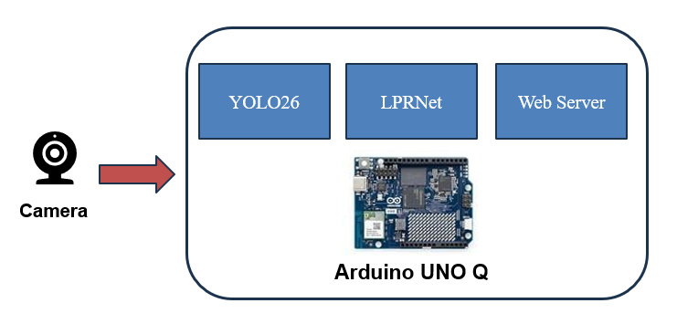
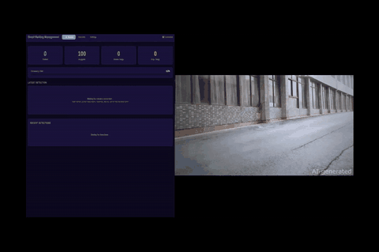

# Qualcomm Arduino UNO Q Edge AI License Plate Recognition

## Advantages of Arduino UNO Q

1.  Hybrid architecture: Integrating a Qualcomm QRB2210 Microprocessor (MPU) with an STM32U585 Microcontroller (MCU) to enable both high-performance computing and real-time control

2.  UNO Q form factor and expandability: Maintaining the classic UNO pin layout while supporting existing shields for easy integration with current hardware

### Motivation:

- License plate recognition system often rely on centralized processing, causing latency. Edge computing enables real-time, on-site decisions, improving efficiency and reliability

### Solution:

- Using the Arduino UNO Q as the core, integrating edge AI and real-time control to deploy lightweight models for on-device feature extraction and license plate recognition

## Architecture Diagram:

The camera captures video streams and processes the image data on the Arduino UNO Q.  
YOLO26 is used for license plate detection, and LPRNet is used for character recognition.  
The Arduino UNO Q also acts as a web server, providing a web interface to display recognition results such as license plate numbers in real time.
All processing takes place on the edge device, ensuring better privacy and data protection

### Demo:

